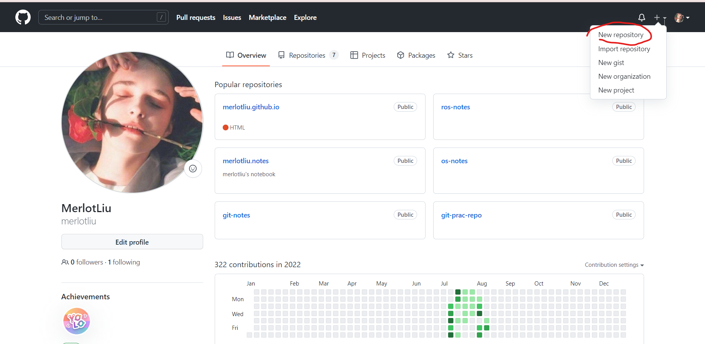
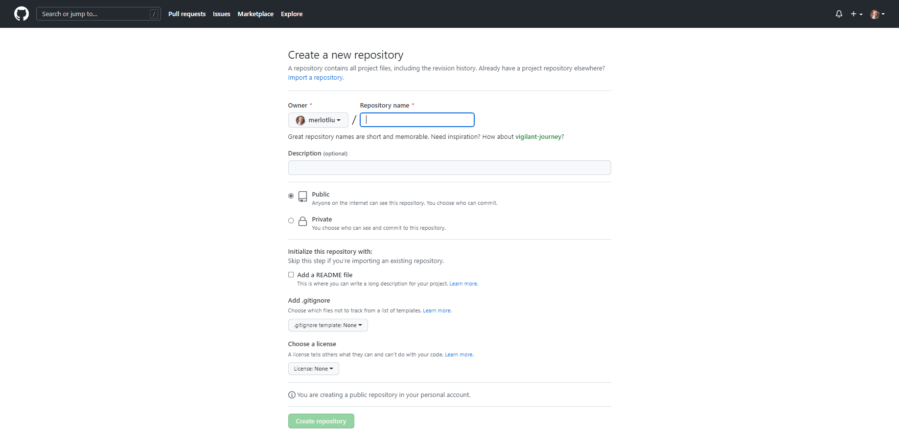

# Github

## 创建新仓库

1. 进入个人主页，点击右上角的`+` ---- `New repository`进入创建新仓库的页面；

2. 输入仓库名称，然后可以选择添加README、.gitignore和license等文件，点击创建仓库即可。

## 初始化仓库

在创建完项目后，Github提供了三种方式初始化项目，在前文的[远程库](./git-tutorials-5-remote)中已做说明，在此不再赘述。

