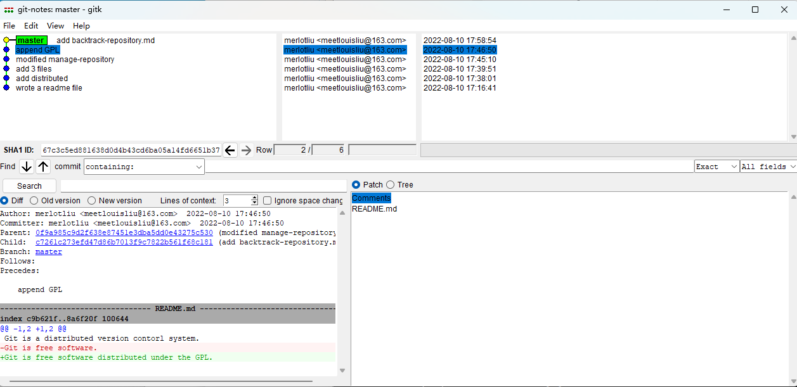

# 版本庫管理

## 版本庫状态

修改README.md文件，爲以下内容：

```
Git is a distributed version control system.
Git is free software.
```

### 1 查看当前版本库状态：git status

运行`git status`命令，查看當前狀態：

```shell
$ git status
On branch master
Changes not staged for commit:
  (use "git add <file>..." to update what will be committed)
  (use "git restore <file>..." to discard changes in working directory)
        modified:   README.md
        
no changes added to commit (use "git add" and/or "git commit -a")
```

可以發現，輸出信息告訴我們，`README.md`文件被修改了但沒有提交。

當前沒有`add`任何文件。

### 2 查看文件区别：git diff

用`git diff`命令查看工作區和版本庫内容的區別：

```
$ git diff
diff --git a/README.md b/README.md
index 4620b7e..c9b621f 100644
--- a/README.md
+++ b/README.md
@@ -1,2 +1,2 @@
-Git is a version contorl system.
+Git is a distributed version contorl system.
 Git is free software.
```

在命令行還能看出顏色的區別，紅色為版本庫的内容，綠色為工作區的内容，白色表示一致。

確定變更的内容沒有問題之後，可以繼續使用`git add`、`git commit`、`git status`提交或查看當前狀態。

```shell
$ git add README.md

$ git status
On branch master
Changes to be committed:
  (use "git restore --staged <file>..." to unstage)
        modified:   README.md

$ git commit -m "add distributed"
[master 2ffd4d4] add distributed
 1 file changed, 1 insertion(+), 1 deletion(-)

$ git status
On branch master
nothing to commit, working tree clean
```

## 版本庫回退

首先，再修改一次README.md文件内容。

```shell
Git is a distributed version control system.
Git is free software distributed under the GPL.
```

提交修改

```shell
$ git add README.md
$ git commit -m "append GPL"
[master 67c3c5e] append GPL
 1 file changed, 1 insertion(+), 1 deletion(-)
```

在項目開發的工程中，我們會不停的修改、添加、刪除文件，並一次次的提交，而有的時候我們的修改會導致項目的問題。這個時候我們就會想到回溯到上一個沒有問題的版本。我們每一次的commit就是一個版本，我們只需要找到一個正常的commit版本即可繼續我們的工作。

### 1 查看提交日志：git log

使用`git log`可以幫助我們查看commit版本信息：

```
$ git log
commit 489bb6c5db63d286cdde8f27aa2304fc6397f6e7 (HEAD -> master)
Author: merlotliu <meetlouisliu@163.com>
Date:   Fri Aug 12 13:05:07 2022 +0800

    append GPL

commit 2d80ce0888b31e6e3275585add58ddcedef3249a
Author: merlotliu <meetlouisliu@163.com>
Date:   Fri Aug 12 13:03:56 2022 +0800

    add distributed

commit 954d5a7354256b6ef5f05286ae02f7b78ce460be
Author: merlotliu <meetlouisliu@163.com>
Date:   Fri Aug 12 12:59:02 2022 +0800

    wrote a readme file
```

`git log`按照從最進到最遠的時間，顯示了我們提交的3個版本、相關提交説明以及作者等信息。

同時，可以添加相關參數以獲得更簡潔的日志信息，比如`--pretty=oneline`：

```
$ git log --pretty=oneline
489bb6c5db63d286cdde8f27aa2304fc6397f6e7 (HEAD -> master) append GPL
2d80ce0888b31e6e3275585add58ddcedef3249a add distributed
954d5a7354256b6ef5f05286ae02f7b78ce460be wrote a readme file
```

### 2 可视化工具查看：Git GUI

可以從GUI中明顯的看到各個版本及其相關信息。



### 3 版本回退：git reset

在確定需要回退的版本之後，使用`git reset`命令幫助回退。在Git中，`HEAD`表示當前版本，`HEAD^`表示上一個版本。儅距離當前版本較遠時，可以使用數字，比如往上10個版本可寫成`HEAD~10`。

現在，我們將回退到上一版本。首先查看一下當前版本的README.md内容:

```
$ cat README.md
Git is a distributed version contorl system.
Git is free software distributed under the GPL.
```

然後使用`git reset --hard <version>`開始回退：

```
$ git reset --hard HEAD^
HEAD is now at 2d80ce0 add distributed
```

接著查看當前版本的`README.md`：

```
$ cat README.md
Git is a distributed version control system.
Git is free software.
```

顯然，我們成功了。

但此時再使用`git log`查看版本庫狀態卻發現最新的版本看不到了:

```
$ git log --pretty=oneline
2d80ce0888b31e6e3275585add58ddcedef3249a (HEAD -> master) add distributed
954d5a7354256b6ef5f05286ae02f7b78ce460be wrote a readme file
```

此時，如果我們想回到那個版本的狀態需要提供其對應的`commit id`，然後使用`git reset --hard <commit id>`：

```
$ git reset --hard 489bb6c
HEAD is now at 489bb6c append GPL
```

顯然，`commit id`也並不需要寫全，保證前綴唯一即可。然後發現，我們又回到最新的版本。

### 4 查看命令记录：git reflog

如果忘記了`commit id`，可以使用 `git reflog`命令查看，該命令記錄了每一次的命令。

```shell
$ git reflog
489bb6c (HEAD -> master) HEAD@{0}: reset: moving to 489bb6c
2d80ce0 HEAD@{1}: reset: moving to HEAD^
489bb6c (HEAD -> master) HEAD@{2}: reset: moving to 489bb6c
2d80ce0 HEAD@{3}: reset: moving to HEAD^
489bb6c (HEAD -> master) HEAD@{4}: commit: append GPL
2d80ce0 HEAD@{5}: commit: add distributed
954d5a7 HEAD@{6}: commit (initial): wrote a readme file
```

## 小結

1. `git status`查看當前版本庫狀態；
2. 用`git diff`查看版本庫與工作區的區別。
3. `git log`查看提交歷史，即各版本信息；
4. `git reset --hard <commit id>`幫助版本回退，`<commit id>`可以是具體的版本號，也可以是`HEAD^`或`HEAD~num`；
5. `git reflog`查看命令歷史；

## Reference

1. [时光机穿梭 - 廖雪峰的官方网站 (liaoxuefeng.com)](https://www.liaoxuefeng.com/wiki/896043488029600/896954074659008#0)
2. [版本回退 - 廖雪峰的官方网站 (liaoxuefeng.com)](https://www.liaoxuefeng.com/wiki/896043488029600/897013573512192)