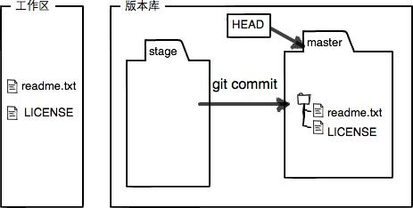

# 工作区 & 暂存区

Git和其他版本控制系统如SVN的一个不同之处就是有暂存区的概念。

## 工作区（Working Directory）

前文创建的Git目录中非隐藏的目录，都是工作区。

可以使用 `git status`查看當前狀態，如果工作區沒有任何修改或修改已提交完，則表明工作區是乾淨的。

```shell
$ git status
On branch master
nothing to commit, working tree clean
```

## 版本库（Repository）

目录下的`.git`即为版本库。

版本库中的stage（或index）即为暂存区，此外在`git init`时，会默认创建默认的`master`分支，`HEAD`指针默认指向`master`分支。


`git add`的作用：将文件修改添加到暂存区。

`git commit`的作用：将暂存区的内容提交到当前分支（分支是可以切换的）。

事实上就是，将需要提交的文件添加到暂存区，然后将暂存区的内容一次提交到分支。

## 示例

1. 添加LICENSE新文件；

2. 对README.md修改为以下内容：

   ```
   Git is a distributed version control system.
   Git is free software distributed under the GPL.
   Git has a mutable index called stage.
   ```

3. 查看當前狀態：

   ```shell
   $ git status
   On branch master
   Changes not staged for commit:
     (use "git add <file>..." to update what will be committed)
     (use "git restore <file>..." to discard changes in working directory)
           modified:   README.md
   
   Untracked files:
     (use "git add <file>..." to include in what will be committed)
           LICENSE
   ```

​		显然，输出告诉我们README.md被修改，LICENSE从未被提交。

4. 将两个文件添加到暂存区：

   ```
   $ git add README.md LICENSE
   ```

   如下為當前版本庫狀態

   

5. 提交到分支

   ```shell
   $ git commit -m "understand how stage works"
   [master f1e7833] understand how stage works
    2 files changed, 1 insertion(+), 1 deletion(-)
    create mode 100644 LICENSE
   ```

   `git commit`相當於將暫存區清空了，然後版本庫狀態變更爲

   

## Reference

1. [工作区和暂存区 - 廖雪峰的官方网站 (liaoxuefeng.com)](https://www.liaoxuefeng.com/wiki/896043488029600/897271968352576)