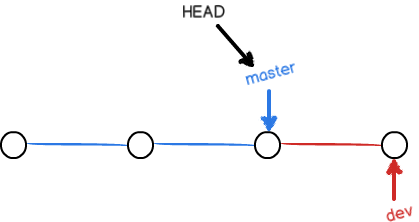

# Git 分支

## 创建与合并分支

### 原理

版本库的追踪就是`commit`的连续节点，`master`指向最新的`commit`，`HEAD`指向`master`。`master`仅为标识分支的指针，`HEAD`指向谁表示谁是当前分支。当只有`master`时，版本库的追踪如下：


### 创建&切换分支

如果此时创建新分支`dev`，则创建一个指针`dev`指向`master`指向的`commit`。如果切换分支到`dev`，则：


因为仅仅创建指针和改变`HEAD`的指向，所以速度非常快。

### 修改并提交分支

切换分支后，我们进行修改并提交。此时，`dev`分支开始生长，而`master`不变，即：


### 合并分支

因为`master`此时并没有发生任何变更，所以将`dev`的内容合并到`master`仅需，移动`master`指针到`dev`的位置即可。


随后，我们就可以将`dev`分支删除。

### 示例

#### 1 创建分支切换分支：

```shell
$ git branch dev
$ git checkout dev
Switched to branch 'dev'
```

或使用一条指令：

```
$ git checkout -b dev
Switched to a new branch 'dev'
```

#### 2 查看當前分支：

```
$ git branch
* dev
  master
```

`git branch`命令会列出所有分支，当前分支前面会标一个`*`号。

#### 3 修改`dev`分支内容並提交；

```
$ echo "Creating a new branch is quick." >> README.md
$ git add README.md
$ git commit  -m "branch test"
[dev 882e9c3] branch test
 1 file changed, 1 insertion(+)
```

#### 4 切換回`master`分支：

```
$ git checkout master
Switched to branch 'master'
```

此時，多個commit、master、dev和HEAD形成的DAG（有向無環圖）如下：



#### 5 將`dev`分支的工作成果合并到`master`分支上：

```
$ git merge dev
Updating 2296a12..882e9c3
Fast-forward
 README.md | 1 +
 1 file changed, 1 insertion(+)
```

注意到上面的`Fast-forward`信息，Git告诉我们，这次合并是“快进模式”，也就是直接把`master`指向`dev`的当前提交，所以合并速度非常快。因为`master`分支没有任何更改，即两个分支没有出现冲突，`dev`为最新的内容，仅需要移动`master`指针即可。

#### 6 删除`dev`分支：

```
$ git branch -d dev
Deleted branch dev (was 882e9c3).
```

删除后，查看`branch`，就只剩下`master`分支了：

```
$ git branch
* master
```

### git switch

`git checkout`提供了多种功能，但用来切换分支总觉得不太好理解。所以Git提供了新的git switch命令来切换分支：

创建并切换到新的`dev`分支，可以使用：

```
$ git switch -c dev
```

直接切换到已有的`master`分支，可以使用：

```
$ git switch master
```

使用新的`git switch`命令，比`git checkout`要更容易理解。

### Notes

因为创建、合并和删除分支非常快，所以Git鼓励你使用分支完成某个任务，合并后再删掉分支，这和直接在`master`分支上工作效果是一样的，但过程更安全。

### 小结

Git鼓励大量使用分支：

查看分支：`git branch`

创建分支：`git branch <name>`

切换分支：`git checkout <name>`或者`git switch <name>`

创建+切换分支：`git checkout -b <name>`或者`git switch -c <name>`

合并某分支到当前分支：`git merge <name>`

删除分支：`git branch -d <name>`

## 合并冲突

在项目开发过程中，由于有多条分支且在一段时间内均为单独开发，这样就有可能在不同分支对同一文件进行了修改，从而产生冲突。

### 示例

考虑以下情况：

目前，当前仓库仅有`master`分支，接着创建`feature`分支。

然后分别对两个分支的`README.md`修改。在`feature`分支中，追加`Creating a new branch is quick AND simple.`到`README.md`。切换回`master`分支，在`master`分支中，追加`Creating a new branch is quick & simple.`到`README.md`。

```
$ git switch -c feature
Switched to a new branch 'feature'

$ echo "Creating a new branch is quick AND simple."  >> README.md

$ git add README.md
$ git commit -m "AND simple"
[feature 03b654f] AND simple
 1 file changed, 2 insertions(+)
 
 $ git reset --hard HEAD^
HEAD is now at 882e9c3 branch test

$ git switch master
Switched to branch 'master'
Your branch is ahead of 'origin/master' by 1 commit.
  (use "git push" to publish your local commits)

$ echo "Creating a new branch is quick & simple." >> README.md

$ git add README.md
$ git commit -m "& simple"
[master c72882e] & simple
 1 file changed, 1 insertion(+)
```

准备将`feature`内容合并到`master`。

```shell
$ git merge feature
Auto-merging README.md
CONFLICT (content): Merge conflict in README.md
Automatic merge failed; fix conflicts and then commit the result.
```

此时，由于`README.md`内容冲突，将无法进行快进，需要先解决冲突。当前的版本库节点图如下：


### 解決

1. 查看當前狀態，再次确定冲突

   ```shell
   $ git status
   On branch master
   Your branch is ahead of 'origin/master' by 2 commits.
     (use "git push" to publish your local commits)
   
   You have unmerged paths.
     (fix conflicts and run "git commit")
     (use "git merge --abort" to abort the merge)
   
   Unmerged paths:
     (use "git add <file>..." to mark resolution)
           both modified:   README.md
   
   no changes added to commit (use "git add" and/or "git commit -a")
   ```

    (fix conflicts and run "git commit")这就是Git的解决建议。

2. 打開衝突文件，修改爲最終需要的内容，然後提交。

   ```
   Git is a distributed version control system.
   Git is free software distributed under the GPL.
   Git has a mutable index called stage.
   Git tracks changes.
   Creating a new branch is quick.
   <<<<<<< HEAD
   Creating a new branch is quick & simple.
   =======
   
   Creating a new branch is quick AND simple.
   >>>>>>> feature
   ```

   Git用`<<<<<<<`，`=======`，`>>>>>>>`标记出不同分支的内容，我们修改如下后保存：

   ```
   Creating a new branch is quick and simple.
   ```

   再提交：

   ```
   $ git add README.md
   $ git commit -m "confict fixed in README.md"
   [master 228887d] confict fixed in README.md
   ```

3. 查看分支合并情況（其中的`*`代表的是就是`commit`节点）

   ```
   $ git log --graph --pretty=oneline --abbrev-commit
   *   228887d (HEAD -> master) confict fixed in README.md
   |\
   | * 03b654f (feature) AND simple
   * | c72882e & simple
   |/
   * 882e9c3 (dev) branch test
   * 2296a12 (origin/master) add test.txt
   * c11fc99 remove test.txt
   * 7454a99 add test.txt
   * 0d136ba git tracks changes
   * 4075e3b understand how stage works
   * 489bb6c append GPL
   * 2d80ce0 add distributed
   * 954d5a7 wrote a readme file
   ```

   當前各分支的狀態圖：

   

4. 刪除已經完成工作的`feature`分支。

   ```
   $ git branch -d feature
   Deleted branch feature (was 03b654f).
   ```

### 小結

合并出现冲突时，Git会提醒我们消除冲突，根据提示修改相应文件并提交，即可完成冲突合并。

用`git log --graph`命令可以看到分支合并图。（其中的`*`代表的是就是`commit`节点）

## 分支管理策略

合并分支时，如果其他分支创建之后，合并到的分支没有提交修改，Git会采用 `Fast forward` 模式。在这一模式下，分支删除后，不能看出任何合并信息。

如果要强制禁用`Fast forward`模式，Git就会在merge时生成一个新的commit，这样，从分支历史上就可以看出分支信息。

### 示例

1. 创建新分支`dev`；
2. 修改README.md，提交修改到`dev`；
3. 切换回`master`。使用`git merge`合并分支，并带上`--no-ff`选项禁用`Fast forward`模式，后面跟上`-m "<message>"`，最后加上需要合并的分支（dev）。
4. 最后可以使用`git log --graph --pretty=oneline --abbrev-commit`查看分支合并图。

```shell
$ git switch -c dev
Switched to a new branch 'dev'

$ cat README.md
Git is a distributed version control system.
Git is free software distributed under the GPL.
Git has a mutable index called stage.
Git tracks changes.
Creating a new branch is quick and simple.

$ echo "Merge branch without fast forward." >> README.md

$ git add README.md

$ git commit -m "add merge"
[dev 2bc5f94] add merge
 1 file changed, 1 insertion(+)

$ git switch master
Switched to branch 'master'
Your branch is ahead of 'origin/master' by 4 commits.
  (use "git push" to publish your local commits)

$ git merge --no-ff -m "merge without no-ff" dev
Merge made by the 'ort' strategy.
 README.md | 1 +
 1 file changed, 1 insertion(+)

$ git log --graph --pretty=oneline --abbrev-commit
*   b72bb0f (HEAD -> master) merge without no-ff
|\
| * 2bc5f94 (dev) add merge
|/
*   228887d confict fixed in README.md
```

整个节点图如下：


### 分支策略

1. `master`应作为稳定的发布分支，尽量避免修改；
2. `dev`为开发分支，平时的小修小补都在上面（`dev`应该是最新的内容）；
3. 每次工作的合理步骤：
   1. 拉取（pull）`dev`的最新内容，以此为基础创建新分支；
   2. 在新分支开发，开发完后提交到新分支；
   3. 切换回`dev`并将内容合并，最后推送到远端的`dev`。

所以，团队合作的分支看起来就像这样：


## Bug分支

在软件开发过程中，`master`需要修复一个代号为`101`的bug。此时，我们会考虑创建一个分支`issue-101`来进行修复。但此时，你仍在`dev`开发新任务，并且暂时无法提交内容。Git提供了`stash`功能，帮助保护和恢复工作现场。

### 保护 & 恢复现场

#### git stash

切換到`dev`分支，使用git stash保存当前工作区的进度，并查看当前状态

```
$ git switch dev
Switched to branch 'dev'

$ git stash
Saved working directory and index state WIP on dev: 9b3427f add Merge

$ git status
On branch dev
nothing to commit, working tree clean
```

在bug修复之后，可以使用以下两种方式恢复现场：

1. 使用`git stash apply`恢复，但是恢复后，stash内容并不删除，你需要用`git stash drop`来删除。
2. 用`git stash pop`，恢复的同时把stash内容也删了；

#### git stash apply & git stash drop

```
$ git stash apply
On branch dev
Changes not staged for commit:
  (use "git add <file>..." to update what will be committed)
  (use "git restore <file>..." to discard changes in working directory)
        modified:   git-branch.md

no changes added to commit (use "git add" and/or "git commit -a")
$ git stash drop stash@{0}
Dropped stash@{0} (d1d20af3356261bfb522ad6904fcc5963c20a5e9)
```

#### git stash pop

```
$ git stash pop
On branch dev
Changes not staged for commit:
  (use "git add <file>..." to update what will be committed)
  (use "git restore <file>..." to discard changes in working directory)
        modified:   git-branch.md

no changes added to commit (use "git add" and/or "git commit -a")
Dropped refs/stash@{0} (e3bde066af3e0b7facdb0aaba987e99658bb0d95)
```

### Bug修復

```shell
$ git switch -c issue-101
Switched to a new branch 'issue-101'

$ echo "fix bug 101" >> README.md

$ git add README.md

$ git commit -m "fix bug 101"
[issue-101 687f515] fix bug 101
 1 file changed, 1 insertion(+)

$ git switch master
Switched to branch 'master'
Your branch is ahead of 'origin/master' by 7 commits.
  (use "git push" to publish your local commits)

$ git merge --no-ff -m "merge bug fix 101" issue-101
Merge made by the 'ort' strategy.
 README.md | 1 +
 1 file changed, 1 insertion(+)
```

我們在`master`分支合并了分支`issue-101`修復了bug，但dev是在`master`修復之前copy的，也就是說bug在`dev`同樣存在。

Git提供了一个`cherry-pick`命令，能夠幫助我們让我们能复制一个特定的提交到当前分支。

在`issue-101`分支提交修復的bug時，我們獲得了`commit id`——`[issue-101 687f515] fix bug 101`。

现在切換到dev分支，使用`git cherry-pick <commit-id>`即可：

```
$ git cherry-pick 687f515
[dev 2549f29] fix bug 101
 Date: Sat Aug 13 21:53:17 2022 +0800
 1 file changed, 1 insertion(+)
```

## Feature分支

在开发过程中，有一些代码需要现经过测试才能保证正常使用。如果全部在一条分支上开发，一旦新内容出现问题，修复就会是一个比较麻烦的事情。

故，在开发新功能的时候：创建新分支feature并切换 ---- 开发 ---- 合并 ---- 删除分支。（实际上这一过程与 bug 分支是一样的）

### 示例：

```shell
# 創建并切换分支
$ git switch -c feature-vulcan
Switched to a new branch 'feature-vulcan'

# 开发
$ touch vulcan.py

$ git add vulcan.py
$ git status
On branch feature-vulcan
Changes to be committed:
  (use "git restore --staged <file>..." to unstage)
        new file:   vulcan.py
$ git commit -m "add feature vulcan"
[feature-vulcan 9269171] add feature vulcan
 1 file changed, 0 insertions(+), 0 deletions(-)
 create mode 100644 vulcan.py

# 切换到dev准备合并
# 合并的操作可参考前面的分支合并
$ git switch -c dev
Switched to a new branch 'dev'

# 删除分支
$ git branch -d feature-vulcan
error: The branch 'feature-vulcan' is not fully merged.
If you are sure you want to delete it, run 'git branch -D feature-vulcan'.

# 删除未合并分支
$ git branch -D feature-vulcan
Deleted branch feature-vulcan (was 9269171).
```

## 多人协作

使用`git remote`查看远程库信息，添加`-v`选项以显示更详细的信息：

```shell
$ git remote
origin

$ git remote -v
origin  git@github.com:merlotliu/git-prac-repo.git (fetch)
origin  git@github.com:merlotliu/git-prac-repo.git (push)
```

**Notes:**

1. `git clone`时，Git会将本地`master`分支与远程`master`分支相关联；
2. 远程仓库默认名为`origin`；
3. 显示的远程库信息，`fetch`表示抓取，`push`表示推送，如果没有说明没有对应的权限。

### 推送分支

将当前分支推送到远程库的指定分支，使用`git push <remote-repo> <branch>`：

```shell
# 推送到master
git push origin master

# 推送到dev
git push origin dev
```

分支的推送并非是必要的，只有需要团队合作或远程同步的分支需要推送到远程库。

### 抓取分支

在新设备上克隆仓库 ---- 抓取分支 ---- 开发 ---- 推送到远程分支：

```shell
# 克隆远程仓库并命名为 git-clone
$ git clone https://github.com/merlotliu/git-prac-repo git-clone
Cloning into 'git-clone'...
remote: Enumerating objects: 45, done.
remote: Counting objects: 100% (45/45), done.
remote: Compressing objects: 100% (25/25), done.
remote: Total 45 (delta 17), reused 44 (delta 16), pack-reused 0
Receiving objects: 100% (45/45), done.
Resolving deltas: 100% (17/17), done.

# 切换到 git-clone 目录下
$ cd git-clone/

# 查看当前分支
$ git branch
* master

# 创建、获取dev分支并切换
$ git checkout -b dev origin/dev
Switched to a new branch 'dev'
branch 'dev' set up to track 'origin/dev'.

# 创建新文件、添加、提交
$ touch env.txt
$ git add env.txt
$ git commit -m "add env"
[dev 7455f07] add env
 1 file changed, 0 insertions(+), 0 deletions(-)
 create mode 100644 env.txt

# 将本地dev推送到远程dev
$ git push origin dev
Enumerating objects: 3, done.
Counting objects: 100% (3/3), done.
Delta compression using up to 4 threads
Compressing objects: 100% (2/2), done.
Writing objects: 100% (2/2), 271 bytes | 271.00 KiB/s, done.
Total 2 (delta 0), reused 0 (delta 0), pack-reused 0
To https://github.com/merlotliu/git-prac-repo
   2f0bc0d..7455f07  dev -> dev
```

### 推送冲突

当一个文件在多台设备进行了修改，推送时可能遇到冲突（类似分支合并时候的冲突）。此时，我们只需要根据提示，先使用`git pull`更新本地库，在本地合并解决冲突，然后推送即可。

如果本地`dev`未与远程`origin/dev`分支连接，可使用以下命令设置：

```
$ git branch --set-upstream-to=origin/dev dev
branch 'dev' set up to track 'origin/dev'.
```

#### 推送冲突示例

```shell
# dev分支内容添加
$ touch env.txt && echo "env" > env.txt
$ cat env.txt
env
$ git add env.txt
$ git commit -m "add env"
[dev 8486e17] add env
 1 file changed, 1 insertion(+)
 create mode 100644 env.txt

# 推送并出現衝突
$ git push origin dev
To github.com:merlotliu/git-prac-repo.git
 ! [rejected]        dev -> dev (fetch first)
error: failed to push some refs to 'github.com:merlotliu/git-prac-repo.git'
hint: Updates were rejected because the remote contains work that you do
hint: not have locally. This is usually caused by another repository pushing
hint: to the same ref. You may want to first integrate the remote changes
hint: (e.g., 'git pull ...') before pushing again.
hint: See the 'Note about fast-forwards' in 'git push --help' for details.

# 設置分支關聯
$ git branch --set-upstream-to=origin/dev dev
branch 'dev' set up to track 'origin/dev'.

# 获取远程库dev分支最新内容并合并分支解决冲突
$ git pull
remote: Enumerating objects: 3, done.
remote: Counting objects: 100% (3/3), done.
remote: Compressing objects: 100% (2/2), done.
remote: Total 2 (delta 0), reused 2 (delta 0), pack-reused 0
Unpacking objects: 100% (2/2), 251 bytes | 41.00 KiB/s, done.
From github.com:merlotliu/git-prac-repo
   2f0bc0d..7455f07  dev        -> origin/dev
Auto-merging env.txt
Merge made by the 'ort' strategy.

# 再次推送并成功
$ git push origin dev
Enumerating objects: 7, done.
Counting objects: 100% (7/7), done.
Delta compression using up to 4 threads
Compressing objects: 100% (3/3), done.
Writing objects: 100% (4/4), 415 bytes | 138.00 KiB/s, done.
Total 4 (delta 2), reused 0 (delta 0), pack-reused 0
remote: Resolving deltas: 100% (2/2), completed with 1 local object.
To github.com:merlotliu/git-prac-repo.git
   7455f07..bcca5bf  dev -> dev
```

## Rebase

将本地未push分叉commit历史整理成直线（实际上是丢弃了远程库修改的内容，仅保留了合并的信息）；

使得commit历史更为清晰；

### 示例

我们进行以下操作：查看当前commit历史树 ---- 本地修改添加新内容 ---- 再次查看log ---- 推送到远程分支（发现冲突） ---- git pull ---- 再次查看log（发现commit历史分叉） ---- git rebase（将commit分叉整理成直线，实际上是丢弃了远程分支的更改只保留合并内容）---- 再次查看log ：

```shell
$ git log --graph --pretty=oneline --abbrev-commit
*   bcca5bf (HEAD -> dev) Merge branch 'dev' of github.com:merlotliu/git-prac-repo into dev fix env conflict
|\
| * 7455f07 add env
* | 8486e17 add env
|/
* 2f0bc0d (origin/master, master) add dot
* eeef06a remove test.txt
*   0024cbe merge bug fix 101
|\
| * 687f515 fix bug 101
|/
*   b72bb0f merge without no-ff
|\
| * 2bc5f94 add merge

# 本地dev两次修改提交
$ touch rebase.txt
$ git add rebase.txt && git commit -m "add rebase.txt"
[dev 1e436b1] add rebase.txt
 1 file changed, 0 insertions(+), 0 deletions(-)
 create mode 100644 rebase.txt
$ echo "rebase" >> rebase.txt
$ git add rebase.txt && git commit -m "edit rebase.txt"
[dev 180e843] edit rebase.txt
 1 file changed, 1 insertion(+)

# commit历史树
$ git log --graph --pretty=oneline --abbrev-commit
* 180e843 (HEAD -> dev) edit rebase.txt
* 1e436b1 add rebase.txt
*   bcca5bf Merge branch 'dev' of github.com:merlotliu/git-prac-repo into dev fix env conflict
|\
| * 7455f07 add env
* | 8486e17 add env
|/
* 2f0bc0d (origin/master, master) add dot
* eeef06a remove test.txt
*   0024cbe merge bug fix 101
|\
| * 687f515 fix bug 101
|/
*   b72bb0f merge without no-ff

# 尝试推送，发现远程dev已经更新了
$ git push origin dev
To github.com:merlotliu/git-prac-repo.git
 ! [rejected]        dev -> dev (non-fast-forward)
error: failed to push some refs to 'github.com:merlotliu/git-prac-repo.git'
hint: Updates were rejected because the tip of your current branch is behind
hint: its remote counterpart. Integrate the remote changes (e.g.
hint: 'git pull ...') before pushing again.
hint: See the 'Note about fast-forwards' in 'git push --help' for details.

# 拉取最新dev分支
$ git pull
Merge made by the 'ort' strategy.
 hello.py | 1 +
 1 file changed, 1 insertion(+)
 create mode 100644 hello.py

# 查看当前commit树，发现分叉
$ git log --graph --pretty=oneline --abbrev-commit
*   545a4e4 (HEAD -> dev) Merge branch 'dev' of github.com:merlotliu/git-prac-repo into dev merge remote dev
|\
| *   1146038 (origin/dev) Merge branch 'dev' of https://github.com/merlotliu/git-prac-repo into dev merge remote dev
| |\
| * | adc4a8e add hello.py
* | | 180e843 edit rebase.txt
* | | 1e436b1 add rebase.txt
| |/
|/|
* | bcca5bf Merge branch 'dev' of github.com:merlotliu/git-prac-repo into dev fix env conflict
|\|
| * 7455f07 add env

# git rebase 整理 commit 树
$ git rebase
Successfully rebased and updated refs/heads/dev.

# 再次查看 commit 树
$ git log --graph --pretty=oneline --abbrev-commit
* 1effe19 (HEAD -> dev) edit rebase.txt
* 11eb56b add rebase.txt
*   1146038 (origin/dev) Merge branch 'dev' of https://github.com/merlotliu/git-prac-repo into dev merge remote dev
|\
| *   bcca5bf Merge branch 'dev' of github.com:merlotliu/git-prac-repo into dev fix env conflict
| |\
| * | 8486e17 add env
* | | adc4a8e add hello.py
| |/
|/|
* | 7455f07 add env
|/
* 2f0bc0d (origin/master, master) add dot
```

## Reference

1. [分支管理 - 廖雪峰的官方网站 (liaoxuefeng.com)](https://www.liaoxuefeng.com/wiki/896043488029600/896954848507552)