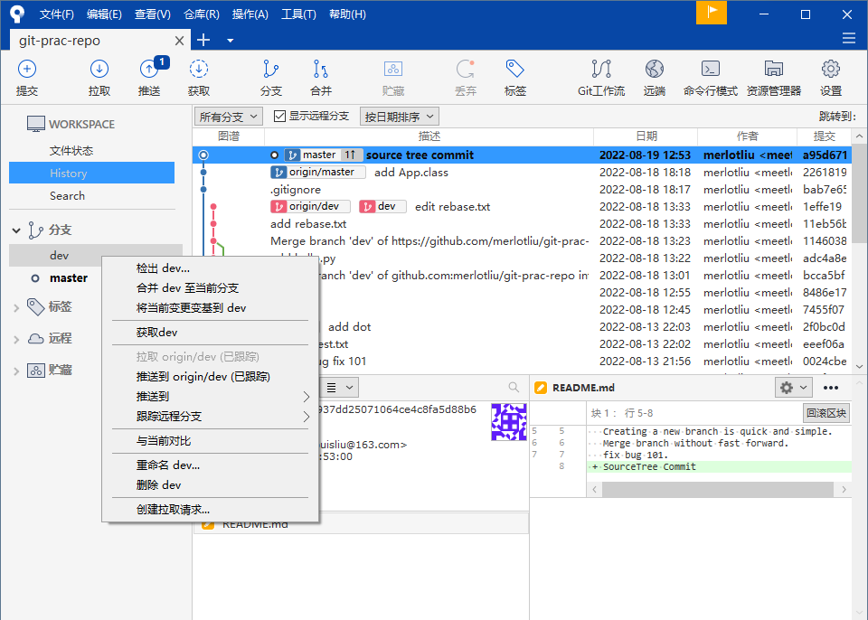

# Git GUI

## Sourcetree

官网：[Sourcetree | Free Git GUI for Mac and Windows (sourcetreeapp.com)](https://www.sourcetreeapp.com/)

### 添加本地库

添加已有库的方法：

1. 新开一个Tab页面 ---- Add ---- 找到本地Git库；
2. 新开一个Tab页面 ---- Clone ---- 输入远程库地址 & 复制到本地的路径 & 本地路径文件夹名；

创建新的版本库：

1. 新开一个Tab页面 ---- Create ---- 输入本地路径 & 名字 & 版本控制系统 ---- 创建；

## 提交 Commit

左侧 WORKSPACE ---- File status（文件状态），会列出文件的状态，可以在旁边的下拉栏选择显示的文件类型。

点击文件右侧的`+`表示将文件暂存，即`git add <file>`。

然后在下方输入说明信息后，点击提交，即`git commit -m "message"`

## 分支 Branch

在对应分支右击即可看到相关的命令操作。

检出 ---- `git checkout`

合并 ---- `git merge `

## 推送 Push

在上方工具栏可以明显的看到推送 Push 和拉取 Pull 的按钮。

点击后，选择弹窗内容，确认即可完成对应操作，然后将会看到完整的输出。

这里由于没有为Sourcetree设置ssh key，导致推送失败，我们找到或生成对应的key并添加到Sourcetree即可。

如果使用的 Github，则：

Tools ---- Options ---- General ---- SSH Client Configuration ---- SSH key ---- 找到

你的密钥。（值得注意的是下面的下拉栏需要选择 OpenSSH）

确认之后，重新 push 即可。

Push 成功不会有提示信息，出错才会弹窗显示详细信息。

## Reference

1. [使用SourceTree - 廖雪峰的官方网站 (liaoxuefeng.com)](https://www.liaoxuefeng.com/wiki/896043488029600/1317161920364578#0)
2. [Sourcetree | Free Git GUI for Mac and Windows (sourcetreeapp.com)](https://www.sourcetreeapp.com/)
3. [Set up an SSH key | Bitbucket Cloud | Atlassian Support](https://support.atlassian.com/bitbucket-cloud/docs/set-up-an-ssh-key/?permissionViolation=true)