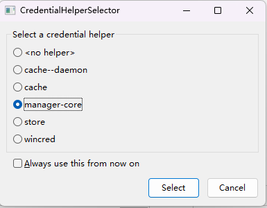

# Git Toubleshooting

## push 失败

### 情况1：

```shell
$ git push origin dev
To https://github.com/merlotliu/los
 ! [rejected]        dev -> dev (non-fast-forward)
error: failed to push some refs to 'https://github.com/merlotliu/los'
hint: Updates were rejected because the tip of your current branch is behind
hint: its remote counterpart. Integrate the remote changes (e.g.
hint: 'git pull ...') before pushing again.
hint: See the 'Note about fast-forwards' in 'git push --help' for details.
```

#### 原因

**在本地仓库上的修改没有基于远程库最新版本，你的本地仓库版本落后于远程仓库**。

- 有可能是项目的其他人员提交了代码，而本地没有同步；
- 有可能是直接在远程仓库修改，而本地未同步；
- git commit --amend 之后，本地仓库的log版本历史不一致；

#### 解决

如果是前两种，使用

```shell
git pull 远程仓库 分支 --rebase
# 然后修改冲突即可
# 推荐使用
```

如果冲突难以修改，或不想修改，或第三中情况：

```shell
git push --force
# 当然这一使用需开发人员确保代码没有问题，当然有问题也不是什么大事，毕竟还是可以回退版本的
```

#### 参考

1. [(117条消息) Git常见报错：Updates were rejected because the tip of your current branch is behind_风中一匹狼v的博客-CSDN博客](https://blog.csdn.net/weixin_42310154/article/details/118676936)

## warning: in the working copy of 'README.md', LF will be replaced by CRLF the next time Git touches it

### 原因

windows中的换行符为 CRLF， 而在Linux下的换行符为LF。

在Git中，`core.autocrlf`的默認爲`true`。意味著，將工作區的文件提交到暫存區時，Git會檢查文件中的換行符，并將LF轉化爲CRLF。

### 解決

設置`core.autocrlf`為`false`，並刪除暫存區文件，重新提交。

```
# 禁用自動轉化
$ git config --global core.autocrlf false 
# 清除暫存區文件 "git rm --cached <file>..."
$ git rm --cached <file>
# 然後重新添加文件
```

## CredentialHelperSelector弹窗

### 原因

通常是没有为该仓库保存用户和密码，使得每次提交都需要输入。



### 解决

使用`git credential-helper-selector`可将该弹窗显示，选择`manager-core`，勾选`Always use this from now on`，点击`Select`即可。

## error: src refspec master does not match any

### 错误描述

```
$ git push -u origin master
error: src refspec master does not match any
error: failed to push some refs to 'github.com:merlotliu/coding.notes.git'
```

### 原因

本地仓库初始化后未`add&commit`。

### 解決

完成`add&commit`后，重新`push`即可。

## Reference

1. [错误 warning: LF will be replaced by CRLF in README.md. - ryxiong728 - 博客园 (cnblogs.com)](https://www.cnblogs.com/ryxiong-blog/p/11268952.html)